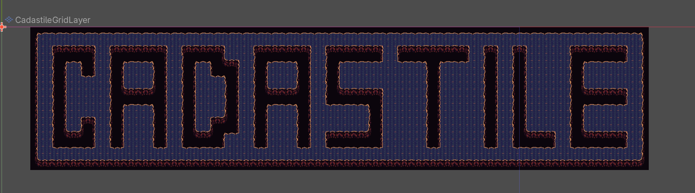
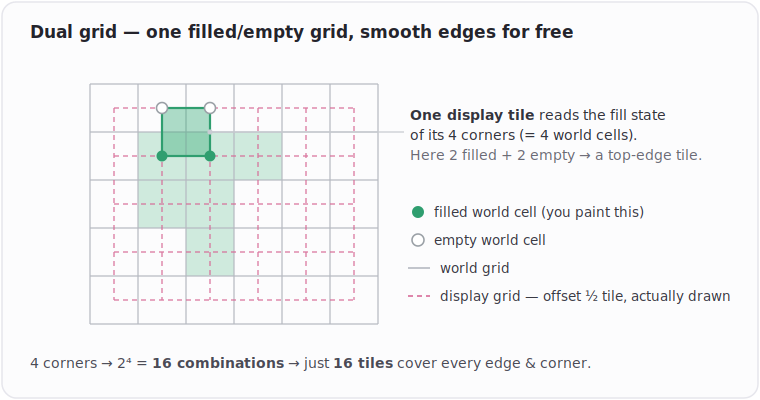

<p align="center">
  
</p>

A drop-in **dual-grid autotiler** for Godot 4 (C#). You paint a simple filled/empty
grid; CadasTile draws the smooth edges and corners for you from a 16-tile sheet — and
it figures out *which* tile is which by reading tags off the atlas, so your sheet can
be laid out however you like.

**Status: working MVP.** You can tag a sheet, drop it on a layer, and paint terrain and
void directly in the viewport with live guides and a preview. Rough edges and next
steps are in [Roadmap](#roadmap).

---

## The idea in 30 seconds



Classic autotiling asks each cell to look at its 8 neighbours and needs 47+ tiles. A
**dual grid** flips it:

- A **world grid** you paint (each cell is filled or empty).
- A **display grid** offset by half a tile — this is what's actually drawn. Each
  display tile sits on the corner where four world cells meet.

A display tile only cares about the **fill state of its 4 corners** → 2⁴ = **16 tiles**
cover every case. Paint one world cell and the four display tiles around it update, so
edges round off on their own.

CadasTile's twist: the mapping from "corner combination → which atlas tile" is **data,
not code**. Each tile carries a tag saying which of its corners are filled, so the atlas
layout is free — no fixed tile order required.

## What you get right now

- Paint **terrain** and **void** on the world grid, with drag support.
- Automatic edge/corner resolution from your 16-tile sheet.
- A viewport overlay: a faint world grid, the cell under the cursor, and a preview of
  what your next stroke will paint.
- A tool bar in the bottom panel (Draw / Erase / None) with per-tool modes.
- Your painting survives reloads — the world grid is rebuilt from the tiles on load.

---

## Setup

1. **Make the tile set.** In the FileSystem dock: right-click → *Create New → Resource →
   `CadastileTileSet`* → save as `.tres`. (Create it here, not via the inspector's *New*
   button — that always makes a plain `TileSet`.)
2. **Add your sheet.** Open the `.tres`, add your sprite sheet as an atlas source, and
   slice it to your tile size. A standard 4×4 / 16-tile dual-grid sheet is expected
   (PixelLab's dual-grid export works).
3. **Tag the tiles.** Each tile gets one `Vector4I` custom-data value —
   `X:NW  Y:NE  Z:SW  W:SE`, `1` = that corner is filled, `0` = empty. The **void tile**
   (background / fully-empty) is tagged `(0,0,0,0)`. Tags sync into the resource
   automatically as you paint them.
4. **Drop it on a layer.** Add a `CadastileGridLayer` node and drag your `.tres` onto its
   TileSet slot.
5. **Paint.** Select the layer, open the **CadasTile** bottom panel, and go.

## Controls

| Input | Action |
|-------|--------|
| Left click / drag | Run the selected tool (default **Draw → Terrain**) |
| Right click / drag | **Erase** (always) |
| Middle button | Left free for the editor's pan |
| Panel: Tool | Choose **Draw**, **Erase**, or **None** |
| Panel: Mode | Draw has **Terrain** / **Void** (paint the abyss tile) |

---

## How it works (short version)

- **`CadasTileCorner`** — a 4-bit flag (NW/NE/SW/SE). This bit order is the single
  convention everything reads and writes through.
- **`CadastileTileSet`** — your tagged sheet. It keeps a corner-mask → atlas-tile map and
  syncs two ways: tags you paint on the atlas flow into a per-source `CadastileCoords`
  resource, and edits to that resource flow back onto the tiles.
- **`CadastileGridLayer`** — holds the painted world grid (`WorldCellKind` per cell). When
  a world cell changes it re-resolves the four display tiles around it: build each one's
  corner mask, look up the matching tile, place it (or erase). Void cells resolve to the
  `(0,0,0,0)` abyss tile; empty cells to nothing.
- **Editor plugin** — the bottom panel + tool bar, and the cursor that handles viewport
  input and draws the overlay/preview.

Two details worth knowing: the world and display grids are offset **half a tile** (they
interlock — that's the dual grid), and the world grid **isn't saved** — it's rebuilt from
the placed tiles when the scene loads, so neighbour info isn't lost across reopens.

---

## Roadmap

- [ ] Click a source thumbnail to pick the active terrain for painting.
- [ ] Preview the actual resulting tile (not just the affected cells).
- [ ] Toggle the guide overlay from the panel.
- [ ] Multi-terrain / layered transitions (e.g. sand → dirt).
- [ ] Optional one-time default corner tagging for a standard sheet layout.

## Reference: corner tags for a standard 4×4 sheet

Atlas coord → corners to mark as filled (`1`). Verify against your own sheet — layouts
vary between exporters.

```
(0,0) Sw          (1,0) Ne,Se       (2,0) Nw,Sw,Se    (3,0) Sw,Se
(0,1) Nw,Se       (1,1) Ne,Sw,Se    (2,1) Nw,Ne,Sw,Se (3,1) Nw,Ne,Sw
(0,2) Ne          (1,2) Nw,Ne       (2,2) Nw,Ne,Se    (3,2) Nw,Sw
(0,3) —(void)     (1,3) Se          (2,3) Ne,Sw       (3,3) Nw
```

## Acknowledgements

Dual-grid technique and reference implementations by **jess**
([video](https://www.youtube.com/watch?v=jEWFSv3ivTg),
[Godot implementation](https://github.com/jess-hammer/dual-grid-tilemap-system-godot))
and **pablogila** ([TileMapDual](https://github.com/pablogila/TileMapDual)). CadasTile
rebuilds the technique around a data-driven (atlas-independent) mapping and a C# TileSet
subclass.
