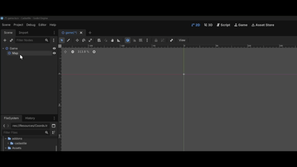
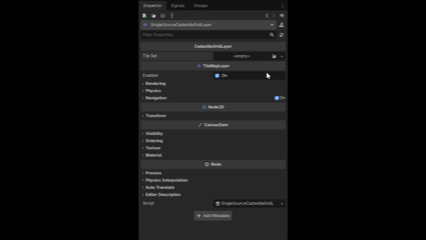
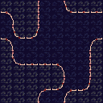
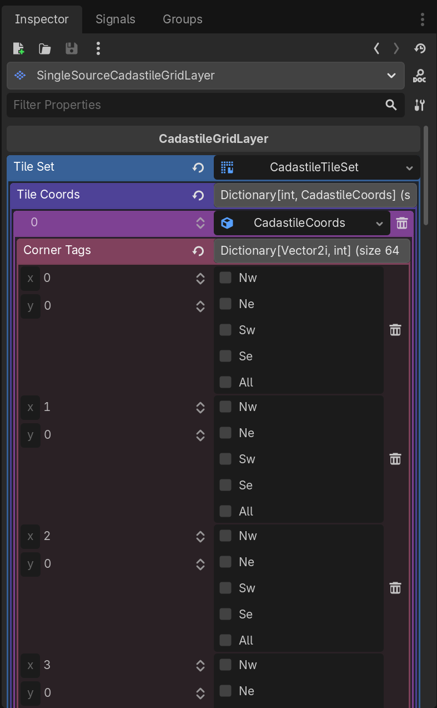
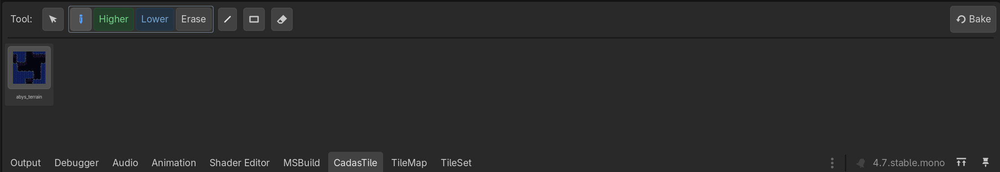
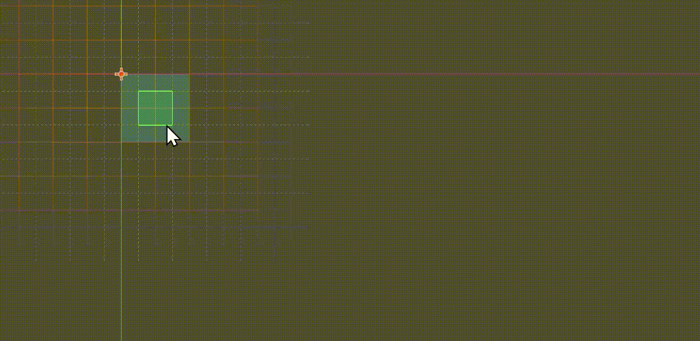
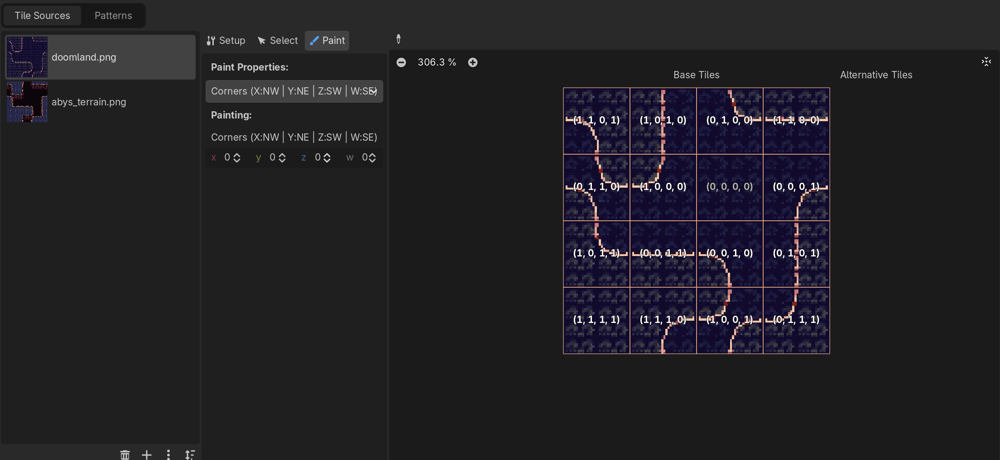

<p align="center">
  
</p>

<p align="center">
  A data-driven <b>dual-grid autotiler</b> for Godot 4 (C#).<br>
  Paint a simple filled/empty grid — CadasTile draws the smooth edges and corners for you.
</p>

**Status: working editor plugin.** Tag a sheet, drop it on a layer, and paint with a full
tool bar (Draw / Line / Rect / Erase), live preview, undo/redo, single- or multi-source
layers, and native-TileMap coexistence. What's next is in the [Roadmap](#roadmap).

---

## The idea in 30 seconds


Classic autotiling asks each cell to look at its 8 neighbours and needs 47+ tiles. A
**dual grid** flips it:

- A **world grid** you paint (each cell is filled or empty).
- A **display grid** offset by half a tile — this is what's actually drawn. Each display
  tile sits on the corner where four world cells meet.

A display tile only cares about the **fill state of its 4 corners** → 2⁴ = **16 tiles**
cover every case. Paint one world cell and the four display tiles around it update, so
edges round off on their own.

**CadasTile's twist:** the mapping from *corner combination → which atlas tile* is
**data, not code**. Each tile carries a tag saying which of its corners are filled, so the
atlas layout is free — no fixed tile order required. This one decision is why CadasTile
can do things Godot's built-in terrain can't: **tile variants**, **multiple terrains on
one layer**, and a fully **reusable** mask→tile mapping (see [Why data-driven](#why-data-driven)).

---

## What you get

- **Tools:** `Draw` (continuous), `Line` and `Rect` (drag a region, right-click mid-drag
  to cancel), `Erase` (left = single cell, right = rectangle), and `None`.
- **Brushes** (the content each tool paints): `Higher` (solid terrain), `Lower` (the abyss
  / void), `Erase`. **Left click = primary brush, right click = secondary** — both are
  chosen in the panel, so e.g. Draw can paint terrain on the left and erase on the right.
- **Live preview:** the cursor shows a faint world grid, the affected cells, and a *ghost
  of the real tile* that will be painted — matching the actual autotile result.
- **Undo / redo:** every stroke (a Draw drag, a Rect/Line fill, an Erase) is one editor
  undo step (`Ctrl+Z` / `Ctrl+Shift+Z`).
- **Single- or multi-source layers:** one terrain per layer (swap the skin any time), or
  several terrains mixed on the same layer.
- **Native-TileMap friendly:** the native TileMap tab still works; paint roughly there,
  then hit **Bake** to fold it into the world grid.
- Painting **survives reloads** — the world grid is rebuilt from the placed tiles on load.

---

## Setup

**1. Add a layer.** Add a **`SingleSourceCadastileGridLayer`** (one terrain) or a
**`MultiSourceCadastileGridLayer`** (mixed terrains) node.



**2. Create the tile set.** FileSystem dock → right-click → *Create New → Resource →
`CadastileTileSet`* → save as `.tres`, or make one right on the layer's TileSet slot in the
inspector (and save it if you want to reuse it).



**3. Add your sheet.** Open the `.tres` and add your sprite sheet as an atlas source, sliced
to your tile size (a 4×4 / 16-tile dual-grid sheet — PixelLab's export works).



**4. Tag the tiles.** Each tile gets one `Vector4I` corner value (`X:NW  Y:NE  Z:SW  W:SE`,
`1` = filled; the abyss tile is `(0,0,0,0)`). Two ways — both sync into a per-source
`CadastileCoords`:

- **Set each tile's custom-data** in the TileSet editor — see the [worked example](#reference-a-worked-example).
- **Or edit the bits** on the `CadastileCoords` in the inspector:



**5. (Optional) Reuse the mapping.** Save the `CadastileCoords` and drop it on any sheet with
the same layout — same bit map, no re-tagging.

---

## Paint

**1.** Select the layer, open the **CadasTile** bottom panel, pick a source (terrain) and a tool.



**2.** Paint to your heart's content.



---

## Controls

| Input | Action |
|-------|--------|
| **Left** click / drag | Run the active tool with the **primary** brush |
| **Right** click / drag | Run the active tool with the **secondary** brush |
| Other button mid-drag | **Cancel** the current Line/Rect drag |
| Middle button | Left free for the editor's pan |
| `Ctrl+Z` / `Ctrl+Shift+Z` | Undo / redo the last stroke |
| Panel: **Tool** | Draw · Line · Rect · Erase · None |
| Panel: **Brush** | Left-click a brush = primary (green), right-click = secondary (blue) |
| Panel: **Sources** | Pick the paint source (single-source: re-skins the whole layer) |
| Panel: **Bake** | Rebuild the world grid from the current tiles (adopt native paint) |

---

## Layer types

- **`SingleSourceCadastileGridLayer`** — one source (skin) for the whole layer, lighter
  storage. Selecting a different source in the panel **re-skins every painted cell**. The
  source is remembered across reloads.
- **`MultiSourceCadastileGridLayer`** — stores a source per cell, so several terrains live
  on one layer. Each terrain autotiles against everything-not-itself; at a seam the
  last-painted one wins. A source deleted from the tile set is treated as empty, so stale
  data can't corrupt its neighbours.

---

## How it works

The pieces, and the one convention that ties them together:

- **`CadasTileCorner`** — a 4-bit flag (NW/NE/SW/SE). This bit order is the single
  convention everything reads and writes through.
- **`CadastileTileSet`** — your tagged sheet. It holds a *mask → atlas tile* map per source
  (keyed by source id, in a `CadastileCoords` resource) and syncs two ways: tags you set on
  the atlas flow into the resource, and edits to the resource flow back onto the tiles.
- **`CadastileGridLayer`** (abstract, `TileMapLayer`) — all the world→display logic:
  painting a world cell re-resolves the four display tiles around it (build each one's
  corner mask, look up the matching tile, place it or erase). `SingleSource` / `MultiSource`
  subclasses only differ in *storage*. Void cells resolve to the `(0,0,0,0)` abyss tile;
  empty cells to nothing.
- **Editor plugin** — a bottom panel bound to a **cursor** that owns the tools; each **tool**
  owns its **brushes**. Interaction (how you paint) lives in the tool; content (what you
  paint) lives in the brush. The cursor handles viewport input and draws the overlay.

Two details worth knowing: the world and display grids are offset **half a tile** (they
interlock — that's the dual grid), and the world grid **isn't saved** — it's rebuilt from
the placed tiles on load, so neighbour info survives reopens.

### Why data-driven

Godot's native terrain does the same corner/bitmask math, but bakes the *mask → tile*
mapping **into the engine and the tile** — one mask, one tile, fixed. CadasTile lifts that
mapping out into a **reusable resource**, which unlocks:

- **Variants / randomness** — tag several tiles with the *same* mask and pick between them.
- **Multiple terrains on one layer**, and applying one mapping to different atlases.
- **Custom atlas layouts** — the sheet can be arranged however you like.

*Same algorithm — the mask↔tile relationship is just data instead of a hard-coded tile property.*

---

## Roadmap

**Patterns (modular / procedural building blocks)**
- [ ] Paint a region and save it as a **pattern** (`.tres`).
- [ ] Stamp patterns back into a layer.
- [ ] **Edge-matching / merge policy** where a pattern meets existing tiles —
      *world grid wins*, *pattern wins*, or make the merge rule itself paintable.

**Variants & fuzziness**
- [ ] **Alternative matching:** several tiles per mask, chosen deterministically (hash of
      the cell) so it's stable across re-resolves, undo and reloads.
- [ ] **Weighted / fuzzy** selection (rarer variants, per-tile weights).

**Smaller items**
- [ ] Toggle the guide overlay from the panel.

---

## Reference: a worked example



The example above is ready to open in [`resources/`](resources/): a `CadastileTileSet`
(`tileset.tres`) plus its tags (`Coords.tres`).

You produce the corner tags whichever way suits you — **paint them** in the viewport (they
sync automatically), **set them** per tile in the inspector, or **write them** in the `.tres`
by hand. Either way the mapping is a per-source `CadastileCoords`: an *atlas coord → mask*
map, where the mask is a 4-bit value — **NW = 1, NE = 2, SW = 4, SE = 8** (add them up; the
abyss tile is `0`). In the `.tres` it looks like:

```
[resource]
script = ExtResource("1_dmktb")
CornerTags = Dictionary[Vector2i, int]({
Vector2i(0, 0): 11,
Vector2i(0, 1): 6,
Vector2i(0, 2): 13,
Vector2i(0, 3): 15,
Vector2i(1, 0): 5,
Vector2i(1, 1): 1,
Vector2i(1, 2): 12,
Vector2i(1, 3): 7,
Vector2i(2, 0): 2,
Vector2i(2, 1): 0,
Vector2i(2, 2): 4,
Vector2i(2, 3): 9,
Vector2i(3, 0): 3,
Vector2i(3, 1): 8,
Vector2i(3, 2): 10,
Vector2i(3, 3): 14
})
```

(e.g. `(0,3): 15` = all four corners filled; `(2,1): 0` = the abyss tile; `(1,1): 1` = NW only.)

## Acknowledgements

Dual-grid technique and reference implementations by **jess**
([video](https://www.youtube.com/watch?v=jEWFSv3ivTg),
[Godot implementation](https://github.com/jess-hammer/dual-grid-tilemap-system-godot))
and **pablogila** ([TileMapDual](https://github.com/pablogila/TileMapDual)). CadasTile
rebuilds the technique around a data-driven (atlas-independent) mapping and a C# TileSet
subclass.
